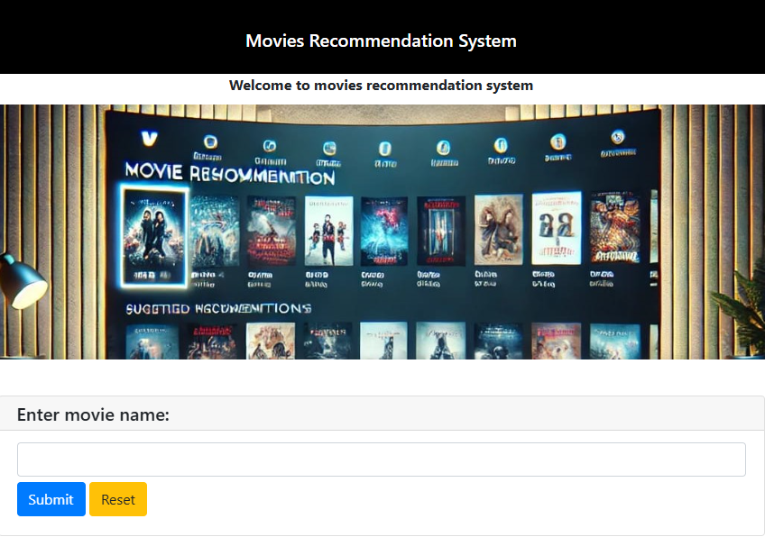

## Task 4(RECOMMENDATION SYSTEM)

## Overview
In this project, I create a simple movies recommendation system that suggests items to
users based on their preferences.

I use content-based filtering technique to recommend movies,then i use pywebio to creat a simple 
web application interface.

## Output

## Dataset
The dataset was taken from kaggle website:
https://www.kaggle.com/datasets/nicoletacilibiu/movies-and-ratings-for-recommendation-system

## Folder Structure
Recommendation.ipynb: File containing data analysis, recommendation system and models download
app.py              : Simple web application using python pywebio.
image               : Folder containing image to use for the web application interface.

## Note
After running the application "app.py" this will appear:
Running on all addresses.
Use http://localhost:4567/ to access the application

Open browser and go to:
http://localhost:4567/

## Author
This project was developed as part of training at CodSoft.

## Acknowledgments
Thanks to CodSoft for providing this opportunity to work on such an exciting task.