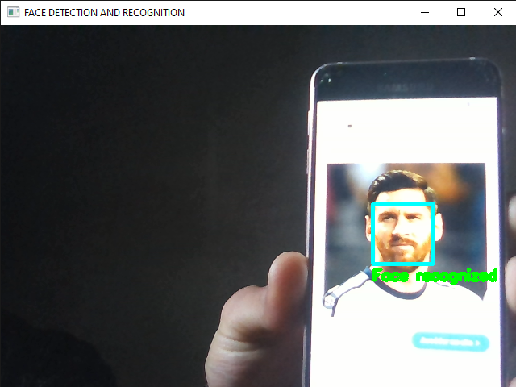
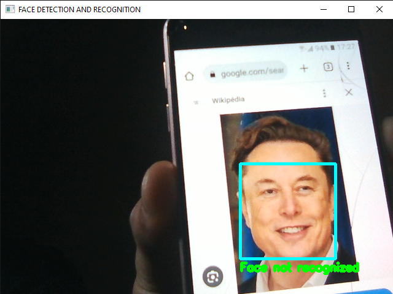

## Task 5(FACE DETECTION AND RECOGNITION)

## Overview
In this project, I create an AI application that can detect and recognize faces in
images or videos.The application use face_recognition python library to detect and recognize faces.

In my application I used a picture of Messi as a detection where the application can distinguish between the given picture and other pictures. 
The picture can be changed according to the needs and the system will compare two faces together and show whether they are identical or not.

## Output

## Author
This project was developed as part of training at CodSoft.

## Acknowledgments
Thanks to CodSoft for providing this opportunity to work on such an exciting task.